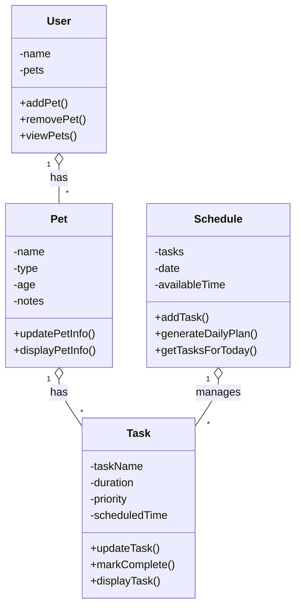

# PawPal+ Project Reflection

## 1. System Design
## System Design

1. Add and Manage Pet Information  
The user should be able to enter and store basic information about their pet, such as name, type, and other relevant details. This allows the system to organize tasks based on the specific pet.

2. Create and Edit Tasks  
The user should be able to add, update, and manage pet care tasks such as feeding, walking, or giving medication. Each task should include important details like duration and priority so the system can make decisions.

3. Generate a Daily Plan  
The user should be able to generate a daily schedule of tasks based on time constraints and priorities. The system should organize tasks in a logical order and provide a clear plan for the day.

### 1a. Initial design

The system is designed using four main classes: User, Pet, Task, and Schedule.

The User class represents the person using the application and is responsible for managing pets. It stores the user’s name and a list of pets, and provides methods to add, remove, and view pets.

The Pet class represents an individual pet and stores information such as name, type, age, and notes. It allows updating and displaying pet information.

The Task class represents a specific pet care activity, such as feeding or walking. It stores details like task name, duration, priority, and scheduled time. It provides methods to update, display, and mark tasks as complete.

The Schedule class manages all tasks for a given day. It keeps a list of tasks and organizes them based on time and priority. It provides methods to add tasks, generate a daily plan, and retrieve tasks for the current day.

Together, these classes separate responsibilities clearly and make the system modular and easy to expand.

### 1b. Design changes

After reviewing the design, I considered adding a direct relationship between Task and Pet to make it clearer which pet each task belongs to. This could improve organization and scalability in future development. However, I decided to keep the current structure to maintain simplicity while still meeting the project requirements.

### Building Blocks

1. Pet  
The Pet object represents an individual pet. It stores information such as the pet’s name, type, age, and notes. It allows the user to update and view pet information.

2. Task  
The Task object represents an activity related to pet care, such as feeding or walking. It stores details like task name, duration, priority, and scheduled time. It allows tasks to be updated, displayed, or marked as complete.

3. Schedule  
The Schedule object manages all tasks for a specific day. It stores a list of tasks and the available time. It can generate a daily plan, organize tasks, and display tasks for the day.

4. User  
The User object represents the person using the app. It stores information such as the user’s name and their pets. It allows the user to add, remove, and view pets.

**a. Initial design**

- Briefly describe your initial UML design.
- What classes did you include, and what responsibilities did you assign to each?

**b. Design changes**

- Did your design change during implementation?
- If yes, describe at least one change and why you made it.

---

### UML Diagram 

## 2. Scheduling Logic and Tradeoffs

**a. Constraints and priorities**

- What constraints does your scheduler consider (for example: time, priority, preferences)?
- How did you decide which constraints mattered most?

**b. Tradeoffs**

- Describe one tradeoff your scheduler makes.
- Why is that tradeoff reasonable for this scenario?

### 2b. Tradeoffs

One tradeoff in the scheduling system is in the conflict detection algorithm. The current implementation only checks for tasks that have the exact same scheduled time. This makes the algorithm simple and efficient, but it does not detect overlapping tasks that occur within the same time range.

For example, if one task starts at 10:00 and another starts at 10:15, the system will not recognize this as a conflict, even though the tasks overlap. A more advanced solution could compare task durations and detect overlaps, but this would add complexity to the system.

The current approach prioritizes simplicity and readability over complete accuracy, which is acceptable for this level of the project.

---

## 3. AI Collaboration

**a. How you used AI**

- How did you use AI tools during this project (for example: design brainstorming, debugging, refactoring)?
- What kinds of prompts or questions were most helpful?

**b. Judgment and verification**

- Describe one moment where you did not accept an AI suggestion as-is.
- How did you evaluate or verify what the AI suggested?

---

## 4. Testing and Verification

**a. What you tested**

- What behaviors did you test?
- Why were these tests important?

**b. Confidence**

- How confident are you that your scheduler works correctly?
- What edge cases would you test next if you had more time?

---

## 5. Reflection

**a. What went well**

- What part of this project are you most satisfied with?

**b. What you would improve**

- If you had another iteration, what would you improve or redesign?

**c. Key takeaway**

- What is one important thing you learned about designing systems or working with AI on this project?

### Algorithmic Planning

The current scheduling system works but is relatively simple. Tasks are stored and displayed, but the logic for organizing and managing them can be improved.

Several areas were identified as overly manual or lacking intelligence. For example, tasks are only sorted by priority and time, but there is no filtering by pet or completion status. Additionally, recurring tasks such as daily feeding are not automatically generated, and the system does not detect scheduling conflicts when tasks overlap in time.

To improve the system, the following algorithmic features will be implemented:

1. Sorting Tasks by Time  
Tasks will be sorted based on their scheduled time to ensure a clear chronological schedule.

2. Filtering Tasks  
The system will allow filtering tasks by pet and by completion status (e.g., pending vs completed).

3. Recurring Tasks  
Tasks with a frequency (e.g., daily) will be automatically regenerated for future dates.

4. Conflict Detection  
The system will detect when two tasks overlap in time and notify the user of potential conflicts.

These improvements will make the system more efficient and user-friendly by automating task management and improving schedule clarity.

### Testing Plan

To verify that the PawPal+ system works correctly, several core behaviors were identified for testing.

1. Adding Tasks  
Ensure that tasks can be successfully added to a pet and stored correctly.

2. Sorting Tasks  
Verify that tasks are sorted by scheduled time in chronological order.

3. Filtering Tasks  
Check that tasks can be filtered by completion status (completed vs pending) and by pet name.

4. Recurring Tasks  
Confirm that when a recurring task (daily or weekly) is marked as complete, a new task is automatically created with the correct future date.

5. Conflict Detection  
Ensure that the system detects when two tasks are scheduled at the same time and returns a warning.

In addition to normal "happy path" scenarios, edge cases will also be tested, such as:
- A pet with no tasks
- Multiple tasks scheduled at the exact same time
- Completing a non-recurring task